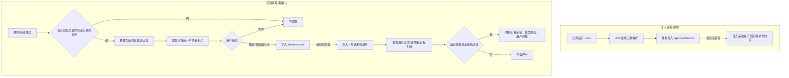

# 以渔 PRD-记忆管理

## 6.1 模块定位与记忆总览

### 6.1.1 模块定位

记忆管理是"以渔"的长期记忆系统，面向价值投资研究场景。它让产品从"每次研究都是陌生人"进化为"越用越懂你的研究搭子"：用户不必每次重复自己的研究习惯，也不必每次从零讲清自己的判断框架。

它与通用记忆机制（Claude / 狍子 / 扣子等的 long-term memory）思路一致——提取、存储、注入、支持增删改查——但因为服务于投资研究，有三处关键不同：

| 通用记忆系统 | 以渔记忆管理 |
| --- | --- |
| 自动提取、静默写入 | 投资认知必须经用户确认才入库（一条错误判断会污染后续所有研究） |
| 记的是偏好、习惯、事实 | 在记偏好习惯的同时，还记投资判断规则与分析框架（有适用条件、可被证伪） |
| 注入时只作背景参考 | 投资认知注入后实际影响研究方向与维度选择，参与结论形成 |

### 6.1.2 记忆的两个维度

理解本章的前提，是分清记忆的两个正交维度——这也是最容易混淆的地方：

**维度一：按内容分类（记的是什么）**

| 类型 | 内容 | 例子 | 是否长期记忆 |
| --- | --- | --- | --- |
| **个人偏好** | 研究习惯、输出偏好、风险取向 | "报告简短点""多关注港股""风险偏好保守" | 是 |
| **投资认知** | 可跨标的复用的判断框架、因果链、决策规则 | "高研发投入的公司不能只看利润表" | 是 |

两者都是长期记忆——都跨会话持久存在、下次还能用。区别只在处理方式。

**维度二：按取用方式分类（存进去怎么取出来用）**

| 取用方式 | 含义 | MVP 是否使用 |
| --- | --- | --- |
| **全量注入** | 条目少，新会话开头全部注入上下文 | 是（偏好几条、认知几十条） |
| **检索召回** | 条目多，按相关性只捞相关的一部分 | 否，认知超过 100 条后才需要 |

> 说明：业界记忆系统常见的"跨会话检索"（用户说"上次那篇 XX"时去历史会话捞片段）属于维度二的一种取用手段，不是一种记忆类型。在以渔的单标的研究场景下，用户复用历史判断的诉求已由投资认知库承接，无需再叠一套会话检索。故 MVP 不做跨会话检索，列入后续版本。

### 6.1.3 两类记忆处理方式对照

| 维度 | 个人偏好 | 投资认知 |
| --- | --- | --- |
| 入库方式 | 静默自动提取 | 需用户逐条确认 |
| 数据结构 | 一句话 | 核心主张 + 结构化正文 |
| 注入位置 | 系统提示词区域，作背景约束 | 研究上下文，展开为研究问题 |
| 是否影响结论 | 否，只影响输出风格与范围 | 是，参与取证与判断 |
| 是否需引用标注 | 否 | 是 |
| 冲突处理 | 无（本次指令覆盖即可） | 有底线冲突提醒 |

区分依据：投资认知错一条会误导研究结论，代价不可逆且用户不易察觉，因此严把入库关；个人偏好即使提取错了，用户随口就能纠正，不值得每次弹卡确认。

> 后文除非特别说明，"认知"均指需确认的**投资认知**。

---

## 6.2 个人偏好记忆

个人偏好走一条独立的**静默通道**：自动提取、不弹确认卡片、只影响输出风格与研究范围，不进入投资判断链。整体做法对齐通用记忆系统。

### 6.2.1 提取内容

任务结束后从对话中提取三类偏好：

| 偏好类型 | 例子 |
| --- | --- |
| 输出偏好 | "报告简短，先给结论再展开""多放图表少放长段落" |
| 研究习惯 | "偏好先看财务再看行业""关注港股和 A 股，不看美股" |
| 风险取向 | "风险偏好保守，重点提示下行风险" |

偏好描述的是"用户想要什么样的输出/研究方式"，**不含任何可证伪的投资判断**——后者属于投资认知。

### 6.2.2 提取机制

- **触发时机**：每次研究任务结束后，由一个自动 Hook 调用 LLM，从本次完整对话中提取。不在对话中途实时提取。
- **提取方式**：LLM 按上述三类归纳，输出结构化文本条目（一句话一条），写入记忆库、`type = preference`。
- **提取判据**：写在系统提示词里（偏好提取不依赖研究 Skill，任何任务结束都要跑），不做关键词枚举。

### 6.2.3 存储

复用 6.3.4 的统一数据结构，`type = preference`：`statement` 存一句话偏好、`content` 通常为空、`is_hard_constraint` 恒为 false（偏好不作投资底线）。与投资认知同库、不同类型，便于统一管理与展示。

### 6.2.4 注入

- **注入时机**：每次新会话开始的首轮，将全部生效偏好拼成一段摘要，注入到系统提示词区域。
- **注入作用域**：作为全局背景约束，影响输出风格与研究范围，不参与取证、不进入判断链、不需要引用标注。
- **冲突让位当次指令**：若用户在本次对话中给出与既有偏好冲突的指令（如平时偏好简短、本次要求详细展开），以本次指令为准，不改写已存偏好。

### 6.2.5 更新与去重

任务结束提取出的新偏好，与库内已有偏好合并：相同的去重、变化的更新、明显过时的淘汰（对齐通用记忆系统的 merge 逻辑）。合并由 LLM 完成，静默执行，不打断用户。

### 6.2.6 用户交互与管理

偏好在记忆管理页可查看、编辑、删除。用户主动纠正的偏好优先级高于自动提取，纠正后立即生效。偏好类不出现确认卡片。

---

## 6.3 投资认知库

个人认知库存放用户在研究中沉淀下来的判断框架、因果链和决策规则，不是财报数字、新闻材料这类原始资料。认知库内容会被系统在研究中主动复用：研究启动时检索注入，新证据与既有判断冲突时对照提醒。

本节说明：认知定义、字段结构、沉淀与检索机制、冲突处理、用户管理。

### 6.3.1 认知定义与应用场景

**认知的定义**：用户在投资研究中形成并确认的、能够跨任务复用的判断框架、因果链、决策规则及其适用边界。

它必须满足四个条件：

1. **可复用**：不能只对一次研究有效。
2. **有结构**：不是一句孤立观点，而是"条件—逻辑—指标—结论"。
3. **有边界**：说明适用于什么、不适用于什么。
4. **可证伪**：知道出现什么证据时应修改或放弃。

具体标的的历史结论、财报数字、新闻材料、仓位限制，都**不**被定义为认知。

| 举例 | 判断 | 说明 |
| --- | --- | --- |
| "提价是护城河的检验信号而非证据本身，只有提价后销量未显著受损、份额稳定、毛利改善并非来自成本回落、且投入资本回报率同步提升时，才能视为定价权存在" | ✅ 是认知 | 有条件、有逻辑、有结论、有边界 |
| "兆易创新某季度存货同比增长 40%" | ❌ 不是认知 | 具体财报数字 |
| "我觉得这家公司护城河很深" | ❌ 不是认知 | 孤立观点，无结构、无边界、不可证 |

**应用场景**：

| 序号 | 应用场景 | 已沉淀认知（示例） | 触发时机 |
| --- | --- | --- | --- |
| 1 | 复用用户分析框架 | "研究高研发投入公司不能只看利润表：先看生意本质、再验证护城河、然后检验成长质量、最后回到估值" | 首次研究新标的，如"帮我看看寒武纪值不值得投" |
| 2 | 跨案例迁移，不复制结论 | "提价是护城河的检验信号，不是证据本身；需销量未受损、份额稳定、渠道库存正常、毛利改善非成本回落、ROIC 同步提升，方可视为定价权" | 研究一家刚宣布提价的新公司 |
| 3 | 与既有原则冲突时主动提醒 | "依赖持续外部融资、经营现金流长期无法覆盖资本开支的成长，不是高质量成长" | Agent 对某公司看多，但财务质量维度证据显示高杠杆、现金流弱 |
| 4 | 用户纠正后沉淀共同确认的规则 | 无（由本次纠正产生） | Agent 称"毛利率高说明护城河强"，用户纠正："高毛利≠护城河，需看跨周期稳定性、进入壁垒、ROIC 是否高于资本成本" |

### 6.3.2 核心机制：提取 → 确认 → 注入

#### 6.3.2.1 认知提取

在研究过程中或研究收敛后，模型识别用户是否表达了一条可跨标的复用的投资判断。

判定标准只有一条：**把用户这句话里的具体公司名去掉后，它是否仍然成立、且能指导下一次研究。** 成立（如"高研发公司利润表会失真"）→ 生成候选认知；不成立（如"兆易创新现在估值偏高"，去掉标的后语义为空）→ 不提取。

模型可参考以下信号识别（信号仅辅助召回，最终仍以上述判定标准为准）：

| 信号 | 识别方式 | 例子 |
| --- | --- | --- |
| 用户纠正 Agent 判断 | 用户否定/修正了 Agent 上一轮的结论或方法 | "高毛利率不等于护城河" |
| 用户补充研究维度 | 用户要求增加/替换判断依据 | "还得看毛利跨周期稳定性" |
| 普遍化表述 | 泛指量词/类指 + 判断动词："这类公司""一般来说""凡是……都要" | "凡是靠外部融资撑增长的，我都不认成长质量" |
| 用户给出因果解释 | 出现机制连接词且主语为类而非个体 | "研发费用化会让利润失真，所以……" |
| 显式指令 | 用户明说"记住""以后都按这个来" | — |
| 研究收敛后的用户点评 | 任务结束时用户对方法的评价 | — |

提取时模型完成两件事：判断是否构成认知、把用户原话整理成结构化条目（见 6.3.3 入库摘要）。

**一条必须写死的约束**：用户没有明确给出的数值阈值，一律留空，禁止模型自行补全。模型天然倾向把"高研发"补成"研发费率≥10%"，这个数字是编造的，一旦入库会影响后续全部研究，且用户不知其来源。

#### 6.3.2.2 认知确认（唯一入库口）

投资认知必须经用户显式确认才能入库，系统不得自主写入。

- 模型正常回答完用户当轮问题后，若识别出候选认知，**在回复末尾统一附上确认卡片**，不打断正文、不在对话中途插入。
- 一轮识别出多条，就在结尾一次性列出多张卡片；单次研究任务内最多弹 3 条，多余的排到任务结束后统一展示，避免打扰。
- 确认卡片展示：核心主张、正文、来源原话，各字段可编辑。
- 用户操作：**确认入库 / 编辑后入库 / 丢弃**。未确认的不入库、不注入。

#### 6.3.2.3 认知注入

新的研究任务开始时，将认知库内容注入模型上下文：

- 注入的是**摘要目录**而非全部正文（见 6.3.3 注入摘要）。
- 模型根据本次研究标的自行判断哪些认知相关、如何使用，需要用到某条时再展开其完整正文。
- 每个用到了认知的判断，在产出中标注引用来源，用户可点击查看用了哪条认知、怎么用的——这是"用户能感到产品在用我的思路"的核心体感来源。
- 认知提供的是**待验证假设与取证清单，不是现成结论**：不能因为别的公司符合某条认知，就推断本标的也符合，必须逐项取证。

### 6.3.3 两个摘要怎么做

"摘要"在本模块出现在两个环节，是两件不同的事：

**入库摘要**——发生在提取环节，把用户零散表达压成一条结构化认知：

```
核心主张：一句话，≤40 字，不含公司名
  例：高研发投入的公司不能只看利润表
正文：
  适用于 / 不适用于 / 判断逻辑 / 什么情况下这条要改
```

原则：去掉公司名（抽象为一类公司）、保留因果机制（为什么会这样，而非只罗列现象）、用户没说的数字不补。

**注入摘要**——发生在注入环节，把整个认知库压成一份清单目录：

- 把全部生效认知的**核心主张（一句话）**拼成一份清单注入；
- 模型看清单判断哪几条与本次标的相关，需要用到时再调取该条完整正文。

MVP 阶段单用户认知规模约几十条，清单约一两千字，全量注入即可，模型看到全貌比看检索结果更准。当单用户认知超过 100 条时，再引入检索召回——这是有依据的扩展点，MVP 不提前建设。

### 6.3.4 认知条目的数据结构

个人偏好与投资认知复用同一套结构，以 `type` 区分：

| 字段 | 说明 |
| --- | --- |
| id | 唯一标识 |
| type | `cognition` 投资认知 / `preference` 个人偏好 |
| statement | 一句话核心主张，≤40 字，用于列表展示与产物引用标注，不含公司名 |
| content | 正文（Markdown），承载适用条件 / 判断逻辑 / 证伪条件；偏好类可为空 |
| is_hard_constraint | 布尔，用户勾选"这是我的投资底线"，结论违反时触发 6.3.5 冲突提醒；偏好恒 false |
| status | `active` 生效 / `archived` 失效（不再注入，历史引用仍可解析） |
| source_task_id | 产生该认知的研究任务 |
| created_at / updated_at | 时间戳 |

`is_hard_constraint` 由**用户在确认卡片上勾选，不由模型推断**——只有用户知道自己哪条是底线、哪条只是习惯。

### 6.3.5 底线冲突提醒

当研究结论方向与某条 `is_hard_constraint` 认知相反时，不是简单地把选择甩给用户，而是走"检测 → 模型对比论证 → 用户终裁"三步：既用上模型判断力，又用确定性触发和强制对比模板堵住模型基于惯性乱下结论。

**第一步：冲突检测（确定性触发）**

结论收敛前，系统比对本次结论方向与所用到的 `is_hard_constraint` 认知，方向相反即触发后续流程。这一步是硬规则、不靠模型自觉——不依赖模型主动想起来检查，而是在固定节点强制拉起这次比对。

**第二步：模型显式对比论证（强制，不可跳过）**

触发后，模型必须产出一段结构化对比，而不是直接给结论，至少包含：

- 用户这条认知当初成立的**前提**是什么
- 本次标的上，这个前提**是否依然成立 / 已经变化**
- 若变化，**变在哪、证据是什么**
- 基于以上，模型的**倾向**：认知在本例仍适用 / 认知的前提在本例不成立、本次结论更可信 / 两者都有道理、无法判断

关键：模型的倾向必须建立在"前提对比"之上，不能只说"我觉得这次结论对"。用固定输出模板逼模型走完对比推理，堵死它基于惯性直接下结论的路。

**第三步：呈现与处置（模型表态 + 用户终裁）**

把对比论证连同模型倾向一起呈现，形式从"你自己选"升级为"模型帮你想过了"：

> 你的投资底线：「无自我造血的成长不算高质量成长」
> 本次情况：该公司增长依赖持续外部融资（OCF/Capex 近三年 <1，有息负债率上升）
> **模型判断**：你这条认知的前提（成长应由经营现金流支撑）在本例依然成立，本次增长不满足该前提。因此模型倾向认为这条底线在本例适用，该标的风险较高。
> 你可以：[认可，标注风险] [我有不同看法，保留本次结论] [修订这条认知]

约束：模型可给带理由的倾向，但**不代替用户下最终投资决策、不静默改写认知库**。系统不因冲突自动修改或停用任何认知。这与产品定位一致——优化决策过程，不背书投资结果。

### 6.3.6 用户交互与管理

认知库是用户可直接经营的资产，提供标准增删改查：

| 操作 | 说明 |
| --- | --- |
| 列表 | 查看全部认知，默认按最近使用排序，可按类型、是否底线筛选 |
| 详情 | 完整正文、引用记录（哪些研究用过它、得出什么结论） |
| 新增 | 手动录入，字段同 6.3.4 |
| 编辑 | 任意字段可改 |
| 删除 | 软删除（改 `archived`），不物理删除——已完成研究的引用链需保持可解析 |
| 底线开关 | 标记 / 取消 `is_hard_constraint` |
| 注入控制 | 单条禁用（本次研究不用某条）；纯净模式（本次不注入任何认知，检验结论是否依赖既有认知） |

**结论侧交互**：针对尚无相关认知的用户，在每次结论后增加一个简短提示，引导其感知框架的价值——

> 本次判断使用了"提价不等于定价权"的分析框架。是否查看这个框架是如何得出结论的？

---

## 6.4 记忆效果与评测

MVP 不设一堆虚指标，只留可落地、可人工核对的几项：

| 指标 | 含义 | 类型 |
| --- | --- | --- |
| 偏好提取准确率 | 抽样人工核对：提取的偏好是否为用户真实表达过的 | 偏好 |
| 偏好遵循率 | 新会话中 Agent 输出是否遵循已存偏好（设了"报告简短"是否真简短） | 偏好 |
| 认知误沉淀率 | 用户在管理页删除认知的比例，过高说明提取质量差（硬指标） | 认知 |
| 注入相关率 | 注入并被模型采用的认知，是否确与本次标的相关 | 认知 |
| 引用可解释率 | 用了认知的判断，是否都标注了可追溯的引用（目标 100%） | 认知 |

预期效果：以渔从"每次研究都是陌生人"进化为"记得你研究偏好、复用你判断框架的搭子"；用户不必每次重复说明自己的研究习惯与输出偏好，历史沉淀的判断框架可跨标的复用。

---

## 6.5 MVP 不做清单

| 项 | 不做的理由 |
| --- | --- |
| 跨会话检索（历史对话捞片段） | 单标的场景下历史判断复用由认知库承接，功能重复；列入后续版本 |
| 向量检索 / 索引召回 | 几十条规模下全量目录优于召回；触发点为超过 100 条 |
| 认知类型细分枚举 | 判断框架、规则、因果链在系统里做同一件事，分类只增维护成本 |
| 关键词触发词典 | 识别交给模型语义判断，不做规则枚举 |
| 版本历史链 / 统计字段 / 例外记录 | MVP 用不到，后续按需再加 |
| 冲突强度分级 / 多步裁决流程 | 底线冲突只做 6.3.5 三步机制 |
| 认知与认知之间的冲突检测 | 库内条目稀疏时该冲突罕见 |
| 团队 / 组织共享记忆 | 需先定义权限模型，MVP 仅个人私有 |

---

## 6.6 机制总览图



图意：两类记忆各走一条通道。偏好静默提取、注入系统提示词、只作背景约束；投资认知需确认才入库、注入研究上下文、逐项取证并标引用、违反底线时走三步冲突机制。
