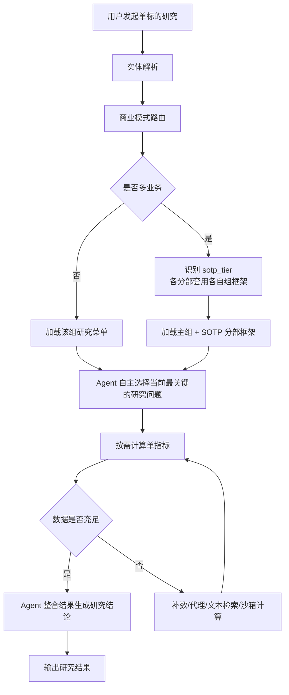
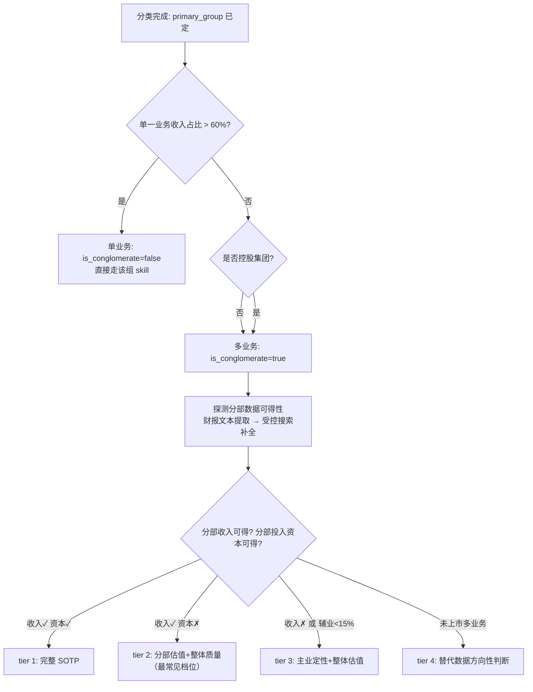

# PRD · 商业模式 Skill（功能模块）

> 模块名称：商业模式 Skill（Business-Model Skill）
> 所属能力域：单标的深度研究 Agent → deep-research
> 文档版本：v1.0（2026-08）
> 读者：后端开发 / Agent 工程 / 数据工程 / QA
> 文档性质：产品版正文 + 开发附录（group / 文件 / 字段 / 公式 / 状态机 / 降级规则 / 评测设计）
> 一句话：**让 Agent 在研究一家公司前，先认出"这是什么生意"，再用这门生意专属的指标口径、估值纪律和研究框架去做研究——而不是用一套通用框架套所有公司。**

---

# 第一部分 · 产品版 PRD

## 1. 模块概述

### 1.1 背景与问题（简述）

价值投资框架（护城河 / 估值 / 安全边际 / 能力圈）是普适的**思想**，但落到**指标口径和估值方法**上，不同生意天差地别：

| 场景 | 错误做法 | 后果 |
|---|---|---|
| 银行 | 算毛利率 / FCF / ROIC | 金融会计结构不同，指标无意义 |
| 周期股 | 用单年 PE 估值 | 顶部利润最高时 PE 最低，看似最便宜实则最危险 |
| 未盈利成长股 | 要求 ROE / FCF 为正 | 系统性误杀好公司 |
| 公用事业 | 判"FCF 为负 = 烧钱" | 在建电厂/管网期 FCF 为负是健康的 |
| 白酒（高存货） | 判"现金转换周期高 = 经营弱" | 基酒窖藏 5 年 + 占用经销商预付款是护城河，不是缺陷 |

**核心结论：不先分商业模式就套用一套硬指标，研究结论的专业性和可信度会崩塌；而把错误数字配上权威档位标签塞给大模型，比不提供数据更危险。**

### 1.2 模块目标

| 目标 | 说明 |
|---|---|
| A. 商业模式路由 | 判断标的属于哪种生意（含多业务公司识别与 SOTP 路由） |
| B. 研究框架注入 | 提供该模式的生死变量、指标菜单、解读陷阱、估值纪律、风险提示 |
| C. 按需指标计算 | Agent 点名算哪个就算哪个，口径易错的走冻结函数 |
| D. 缺数诚实与降级 | 缺什么、去哪补、能否近似、是否降级定性，绝不编数 |

### 1.3 核心设计原则

1. **Agent 主导，工具随取**——Skill 提供护栏和参考菜单，不做固定工作流，不强制算完整包；
2. **先分生意，再做研究**——所有单标的研究，进入指标分析前必须先完成商业模式路由；
3. **菜单是参考，不是必算清单**——每组只定义"通常关注什么"，由 Agent 判断这家公司这个时点该看哪几个；
4. **标准口径冻结**——ROIC / TTM 差分 / 正常化盈利等易错口径写死为冻结函数，非标指标交给 Agent 沙箱现算；
5. **缺数诚实**——结果显式区分 OK / NOT_APPLICABLE / NOT_COMPUTABLE / DEGRADED，禁止静默返回 0/None，禁止编数。

### 1.4 典型使用场景

| 场景 | 输入 | 预期行为 |
|---|---|---|
| 单业务研究 | "研究一下贵州茅台" | 路由 G1a → 重点看定价权、渠道健康度、合同负债、CCC |
| 金融企业研究 | "分析招商银行" | 路由 G2a → 禁用 ROIC/FCF/毛利率，改看 NIM、不良率、拨备、PB-ROE |
| 周期股研究 | "研究陕西煤业" | 路由 G3 → 禁单年 PE 外推，用正常化盈利 + 谷底压力测试 |
| 多业务公司研究 | "分析腾讯控股" | 识别为多业务 → SOTP 路由，各分部套用各自模式的指标体系 |
| 数据不全 | 制造企业缺产能数据 | 明确提示缺字段、建议查年报或代理近似，不卡死不编数 |

---

## 2. 功能方案

商业模式 Skill 由五个子能力组成：

### 2.1 商业模式路由（单业务）

输入公司名或代码，输出该标的所属商业模式 group。

- **零成本优先**：缓存（90 天 TTL）→ 名称关键词快筛 → LLM 判定；
- **LLM 只从白名单选组**：分组枚举写死在 prompt，杜绝编造不存在的组；
- **吃不准就不猜**：置信度过低返回 `needs_review=true`，不硬分；
- **联网兜底**：置信度低时，白名单财经源搜"主营构成"佐证后再判；
- **分类结果必落缓存**：商业模式会漂移，90 天后自动重判。

### 2.2 多业务公司识别与 SOTP 路由

很多标的是多业务公司（腾讯、美团、中国平安），单一商业模式框架无法覆盖。因此**商业模式路由必须同时完成多业务判定**：

#### (a) 多业务判定规则

分类器在判定主导商业模式之后，再判两件事：
1. **是否多业务**（`is_conglomerate`）；
2. **分部数据可得性档位**（`sotp_tier`）。

| 判定条件 | 结果 |
|---|---|
| 无单一业务收入占比 > 60% | 多业务（如腾讯：游戏 32% + 金融科技 31%） |
| 控股集团（本身不经营、只持股） | 多业务 |
| 单一业务收入占比 > 60%（如茅台白酒 99%） | 单业务，直接走该组 skill |

#### (b) SOTP 数据可得性档位（决定分析深度）

| tier | 名称 | 条件 | 处理方式 |
|---|---|---|---|
| 1 | 完整 SOTP | 分部收入 + 利润 + 投入资本齐全 | 真正分部估值 + 分部 ROIC + 加总 + 集团折价 |
| 2 | 分部估值 + 整体质量 | 分部收入可得，分部投入资本不可得（最常见） | 各分部用自己模型做 SOTP 加总 + 集团折价；ROIC/现金流用整体口径并标注"合并口径" |
| 3 | 主业定性 + 整体估值 | 分部披露极差，或辅业 < 15% 可忽略 | 退回主组 skill，结论声明"辅业数据不可得，估值基于主业" |
| 4 | 未上市多业务 | 未上市且为多业务 | 替代数据粗估，只做方向性判断，不得输出低估/高估 |

#### (c) 多业务分析原则

- **分类器只判"主导模式 + 可得性档位"，不锁死各分部归属**——各业务线属于哪个 group 是 SOTP 分析时的事，避免"分类器给的拆法与分析拆法不一致"；
- **各分部套用各自商业模式的指标体系**（如腾讯：游戏用 G4、金融科技用 G2a 视角、投资资产用市值法）；
- **分部投入资本经"财报 + 受控搜索"仍拿不到 → 标 NOT_AVAILABLE 降到 tier2，绝不伪造分部 ROIC**；
- **每个进入估值/结论的分部数字必须带来源**（网页 URL / 财报页码 / 文件名）。

### 2.3 商业模式研究菜单

根据 group 返回（这是"点菜单"，不是"必算清单"）：
- 生意本质（one_liner）；
- 生死变量（kill_variables）；
- 推荐指标菜单 + 每个指标的解读要点/陷阱（note）；
- 估值纪律（主模型 + 交叉验证 + 禁用方法）；
- 关键风险与红旗；
- 金融组的禁用概念声明（如银行禁用毛利率/FCF/ROIC）。

### 2.4 单指标按需计算

Agent 点选指标后，系统按标准口径返回。两种调用方式：

| 方式 | 入参 | 说明 |
|---|---|---|
| ① 按标准指标 | `{symbol, metric_id, group}` | 借用该商业模式菜单里的标准定义（含档位 band） |
| ② 自定义 | `{symbol, formula, inputs}` | Agent 自己指定公式名与字段映射，最灵活 |

返回：`{value, status(OK/NA/NC/DEGRADED), band 档位, caliber 口径, why, reason, missing[]}`。

### 2.5 缺数降级与补算支持

标准计算返回 `NOT_COMPUTABLE` 时，不直接失败，而是返回：
- 缺失字段清单；
- 每个字段该取哪张报表的来源提示；
- 下一步建议（补数 / 代理 / 文本检索 / 沙箱现算 / 转定性）。

非标准指标由 Agent 在**断网计算沙箱**中现算：优先 import 可信公式库现成函数，只能用已取到的数据包字段，禁止心算/编数。

---

## 3. 产品流程

### 3.1 总体流程图



### 3.2 流程说明

1. **识别标的**：统一 symbol / name，锁定唯一公司；
2. **商业模式路由**：判 group + 多业务判定 + tier 初判；低置信显式返回 `needs_review`；
3. **注入研究框架**：单业务注入该组框架；多业务注入主组框架 + SOTP 分部指引；
4. **Agent 自主选择研究重点**：根据用户问题判断本轮优先看什么（品牌消费优先定价权与渠道、银行优先息差与资产质量、周期股优先正常化盈利与周期位置）；
5. **按需计算**：点名算哪个就算哪个；口径易错的走冻结函数；
6. **缺数补算**：按降级链路处理（见附录 H）；
7. **输出结论**：Agent 基于数值 + 状态 + 档位 + 定性框架自己写结论，每个数字可溯源。

---

## 4. MVP 范围

### 4.1 MVP 核心目标

验证一件事：**商业模式 Skill 能否作为研究 Agent 的前置研究支撑层稳定工作。**

### 4.2 必做范围

**P0（必须完成）：**
1. 商业模式路由（含多业务识别：`is_conglomerate` / `sotp_tier` 初判）；
2. 通用价值投资底座 `core`；
3. 品牌消费 `G1a`（范式样板：指标 + 冻结函数 + 菜单 + 解读手册）；
4. 商业模式菜单工具与单指标按需计算工具；
5. 状态体系（OK / NA / NC / DEGRADED）；
6. 缺数字段提示与降级规则；
7. 数据可得性标记（direct / derive / proxy / text / unavailable）；
8. 基础评测集（含黄金 Case）。

**P1（第二阶段补齐）：**
1. `G3` 周期、`G4` 平台/软件、`G6` 高端制造（估值纪律差异最大，验证架构）；
2. `G2a` 银行、`G2b` 保险（`extends: null` 整体替换，金融特殊会计）；
3. SOTP 分部分析落地（tier1 / tier2 路径：分部估值 + 集团折价）；
4. `G1b` 公用事业（override 语义：capex 方向反转、禁用 FCF 门槛）。

**P2（后续）：**
1. `G5` 未盈利 overlay 与主组叠加机制；
2. tier3 / tier4 路径打磨（辅业可忽略 / 未上市替代数据）；
3. 红旗组合自动引擎；
4. 菜单按公司具体情况动态裁剪。

### 4.3 明确不做（MVP 边界）

| 不做 | 原因 |
|---|---|
| 全行业细分覆盖 | 目标是覆盖 90% 标的的分组，剩余用 core 兜底 + 人工标注 |
| 每组塞满 20+ 指标 | 每组只放 5~8 个"必看 + 有标准口径 + 有档位"的指标，其余沙箱现算 |
| 全自动年报文本结构化抽取 | 文本类字段（销量/产能利用率/客户集中度）标记 ▢ text，走检索 |
| 全市场数据完全一致覆盖 | MVP 优先打通 A 股主链路，港美股标记可得性 |
| 把所有红旗做成自动引擎 | 红旗是组合条件，MVP 由 LLM 基于已算指标判断 |

### 4.4 分组拆分标准

> 只问一个问题：**它俩的核心指标或估值方法是否显著不同？** 不同才拆（银行 vs 保险 → 拆）；相同就合并。禁止因"行业名称不同"而过度拆分。

---

## 5. 商业模式分组定义

| group | 名称 | 继承关系 | 核心研究逻辑 | 估值纪律 |
|---|---|---|---|---|
| `core` | 通用价值投资底座 | — | 资本回报 / 现金质量 / 生存力 / 可预测性 | DCF 为主，各组可覆盖 |
| `G1a` | 品牌消费 | extends core | 提价能力、渠道健康度、轻资产高回报 | DCF + ROIC/g，正常化 PE 交叉验证 |
| `G1b` | 受监管公用 | extends core + 大量 override | 准许收益、RAB 扩张、股息持续性 | DDM（股息折现），非 DCF |
| `G2a` | 银行 | **extends: null 整体替换** | 息差、资产质量、拨备、资本充足 | PB-ROE，绝不用简单 PE |
| `G2b` | 保险 | **extends: null 整体替换** | NBV、EV、精算假设、综合成本率 | 寿险 P/EV、财险 PB+综合成本率，绝不用 PE |
| `G3` | 周期 | extends core | 正常化盈利、周期位置、谷底生存能力 | 全周期正常化 PE / PB vs 重置成本，禁单年外推 |
| `G4` | 平台/软件 | extends core | 留存、单位经济、网络效应、SBC 摊薄 | PS/PEG + 单位经济，多业务必须 SOTP |
| `G6` | 高端制造 | extends core | 产能利用率、固定资产效率、折旧纪律 | 周期调整 PE / EV/EBITDA，下行看 PB |
| `G5` | 未盈利成长 overlay | 叠加包，不独立 | 现金跑道、增长斜率、单位经济改善 | 收入拐点 DCF / PS，禁用 PE/ROE/FCF |
| 多业务 | SOTP 路由 | 非独立组 | 主导 group + 各分部套用各自组框架 | 各分部用自己模型加总 + 集团折价 |

---

## 6. 输出契约

### 6.1 路由结果输出

```json
{
  "symbol": "600519.SH",
  "group": "G1a",
  "confidence": 0.92,
  "by": "llm",                // cache / rule_name / llm / llm_web
  "needs_review": false,
  "stage": "profitable",       // profitable / pre_profit / unknown（初判，取数后规则校正）
  "is_conglomerate": false,
  "sotp_tier": 0,              // 0=非多业务；1~4 见 2.2(b)
  "reasoning": "主营白酒，靠品牌收溢价，单一主业"
}
```

### 6.2 菜单输出

```json
{
  "group": "G1a",
  "name": "品牌消费",
  "one_liner": "靠品牌收溢价的复购生意，轻资产、经销商预付款",
  "kill_variables": ["提价能力(还有没有定价权)", "渠道健康度(有没有压货)"],
  "extends": "core",
  "metrics": [
    {"id": "contract_liability_yoy", "看什么": "经销商打款意愿，领先营收1-2季", "note": "白酒最强领先指标；连续下滑警惕需求转弱"}
  ],
  "valuation": "DCF+ROIC/g 主，正常化PE、股息率分位交叉验证",
  "warning": "（金融组）extends=null：禁用 core 的 ROIC/FCF/毛利率类指标"
}
```

### 6.3 指标计算输出

```json
{
  "success": true,
  "metric_id": "roic",
  "name": "投入资本回报率",
  "value": 30.2,
  "status": "OK",
  "band": "优秀",
  "severity": null,
  "unit": "pct",
  "caliber": "NOPAT=EBIT×(1−tax)；投入资本=有息负债+权益−超额现金",
  "why": "价值投资第一指标——赚的钱能否覆盖资本成本",
  "reason": "",
  "missing": [],
  "next_action": ""
}
```

缺数据时：`status="NOT_COMPUTABLE"`，附 `missing: [{field, source_hint}]` 与 `next_action`（补数指引）。

---

## 7. 评测方案

> 评测不是只看"算没算出来"，而是同时评估：路由准不准、指标对不对、不适用时会不会乱判、缺数时会不会胡编、菜单会不会误导、多业务能不能正确拆、Agent 最终结论是否沿正确框架推进。

### 7.1 评测维度

| # | 维度 | 评测目标 |
|---|---|---|
| D1 | 路由评测 | 公司能否进入正确 group；多业务能否正确识别并给出 tier |
| D2 | 指标计算评测 | 冻结指标的 value / status / band / reason 是否正确 |
| D3 | 缺数与降级评测 | 缺字段时能否诚实返回 NC + 精确取数需求；近似是否标 DEGRADED |
| D4 | 行业陷阱评测 | 是否避免把行业特性误判为缺陷 |
| D5 | 多业务评测 | 多业务识别、tier 判定、分部框架正确性、集团折价 |
| D6 | 端到端研究评测 | Agent 最终结论是否使用正确框架、正确指标、正确估值纪律 |
| D7 | 性能评测 | 响应速度、稳定性、可重复性 |

### 7.2 Case 建设原则

**原则 A：每个 group 至少 3 类 case**
1. **标准正例**——最典型、最容易识别的公司；
2. **边界例**——容易混淆、容易误判的公司；
3. **陷阱例**——能暴露错误框架或错误解读的问题公司。

**原则 B：每个 case 至少验证四层结果**
- 路由是否正确；
- 菜单是否正确；
- 核心指标是否正确；
- 研究结论是否沿正确框架。

**原则 C：指标评测不只看数值，还看状态**
必须校验 `status` / `band` / `reason` / `missing`，不只是 value。

**原则 D：多业务 case 单独建类**
多业务公司是独立 case 类型（`case_type: conglomerate`），必须验证 `is_conglomerate`、`sotp_tier`、分部框架三件事。

### 7.3 Case 结构模板

```yaml
case_id: ROUTE-G1A-001
symbol: 600519.SH
market: A
expected_group: G1a
expected_is_conglomerate: false
expected_sotp_tier: 0
case_type: standard          # standard / boundary / trap / conglomerate
must_have_metrics:           # 本 case 必须重点验证的指标
  - contract_liability_yoy
  - cash_conversion_cycle
  - roic
must_not_use_metrics: []     # 本 case 不应使用的指标
expected_status_rules:       # 哪些指标应为 OK / NA / NC / DEGRADED
  interest_coverage: NOT_APPLICABLE
expected_reasoning_points:   # Agent 结论必须覆盖的要点
  - 品牌定价权
  - 渠道健康度
forbidden_reasoning_points:  # Agent 不应出现的错误表述
  - "CCC 高说明经营偏弱"
  - "利息保障为负说明偿债危险"
source_pack:                 # 对账依据（财报页码 / 数据源快照日期）
  period: 2024FY
```

### 7.4 路由评测集（D1）

每个核心 group 至少 3-5 家公司，多业务单独建样本，共约 30-40 个样本：

| group | 标准正例 | 边界例 | 陷阱例 |
|---|---|---|---|
| G1a | 贵州茅台、海天味业 | 美的集团、青岛啤酒 | 兼具消费与制造属性的品牌公司 |
| G1b | 长江电力、宁沪高速 | 中国广核 | 扩张期 FCF 明显为负的公用事业 |
| G2a | 招商银行、宁波银行 | 平安银行 | 零售银行与综合金融边界 |
| G2b | 中国人寿、中国财险 | 众安在线 | 综合险企与多业务集团边界 |
| G3 | 陕西煤业、宝钢股份 | 万华化学 | 周期与制造边界 |
| G4 | 金山办公 | 网易 | 平台与游戏 / 软件边界 |
| G6 | 宁德时代、立讯精密 | 比亚迪 | 制造与品牌 / 制造与周期边界 |
| **多业务** | 腾讯控股（无单一业务>60%） | 美团（~60% 边缘）、中国平安（金融集团） | 港交所（业务线多但单一>90%，不触发） |

**路由验收标准：**
- Top1 路由准确率 ≥ 90%（标准正例 ≥ 95%）；
- 边界样本允许低置信，但**不允许高置信错判**；
- 金融类不得落入非金融组（一票否决项）；
- 多业务公司必须正确输出 `is_conglomerate=true`，不得当单业务硬路由；
- 单一业务占比 >90% 的"多业务嫌疑股"（如港交所）不得误触发 SOTP。

### 7.5 指标计算评测（D2）

每个 group 挑 3-5 个最关键指标做基准校验，校验 value / unit / status / band / 解释是否误导。

**必测黄金 Case：**

| Case | 标的 | 验证点 | 期望 |
|---|---|---|---|
| A. 净现金公司利息保障 | 贵州茅台 | `interest_coverage` | 状态 `NOT_APPLICABLE`（财务费用≤0），**不得算出负倍数并打危险红旗** |
| B. 白酒高 CCC 误判 | 贵州茅台 / 五粮液 | `cash_conversion_cycle` | 数值可以高，但菜单/解读必须提示"窖藏 + 预付款 = 护城河"，不得只写"偏弱" |
| C. 周期顶部低 PE 陷阱 | 煤炭/航运高景气样本 | `normalized_pe` | 不得只看当期 PE；结论必须提"顶部低 PE 陷阱" |
| D. 银行禁用工业指标 | 招商银行 | group 指标约束 | 不应调用 ROIC/FCF/毛利率作核心依据；菜单优先给 NIM/不良/拨备/CET1 |
| E. 保险禁用 PE | 中国人寿 | 估值框架 | 结论不得用 PE 作主估值；寿险提 EV/NBV，财险提综合成本率 |
| F. ROIC 口径 | 贵州茅台 | `roic` | ≈30% 档位"优秀"（NOPAT/投入资本口径），**不得用净利润÷总资产口径** |
| G. 字段映射 | 任意已取数标的 | 全指标 | 数据源已返回的字段必须成功喂进函数，不得因别名不一致报"缺字段" |

### 7.6 缺数与降级评测（D3）

| 场景 | 指标 | 期望 |
|---|---|---|
| 销量缺失 | `price_volume_split` | 返回缺数字段 + 年报文本检索提示；**不得自己估一个销量** |
| 产能利用率缺失 | `utilization` | 返回 NC 或代理路径；走代理必须标 `DEGRADED` |
| 折旧缺失致 EBITDA 近似 | `ebitda` | 可用 EBIT 近似，但必须返回 `DEGRADED` |
| 净利润为 0/负 | `fcf_to_net_income` | 判 `NOT_APPLICABLE`，不得返回 0 或异常值 |
| 全链路 | 任意 | 结论中每个数字可溯源到工具返回值；对不上被治理层打回 |

### 7.7 行业陷阱评测（D4）

| 陷阱 | 测试对象 | 期望 |
|---|---|---|
| 白酒 CCC 高 | G1a | 不误判经营差 |
| 公用事业 FCF 为负 | G1b | 不误判烧钱（扩张期健康） |
| 公用事业 capex 高 | G1b | 识别为 RAB 扩张信号（与 G1a 方向相反） |
| 银行高杠杆 | G2a | 不用普通工业企业杠杆框架解释 |
| 周期顶部低 PE | G3 | 不误判低估 |
| SaaS 高 SBC | G4 | 必须识别隐形摊薄 |
| 制造业低折旧 + 高 capex | G6 | 需提示利润可能被美化 |
| 未盈利公司负 ROE | G5 overlay | 视为不适用，不当简单否定证据 |

### 7.8 多业务评测（D5）

| Case | 标的 | 验证点 | 期望 |
|---|---|---|---|
| M1. 典型多业务 | 腾讯控股 | 识别 + tier | `is_conglomerate=true`；分部收入可得但投入资本合并披露 → tier2；各分部套用各自组框架（游戏 G4 视角 / 金融科技 G2a 视角） |
| M2. 边缘多业务 | 美团 | 触发边界 | 无单一业务 >60% → 触发 SOTP |
| M3. 金融集团 | 中国平安 | tier1 路径 | 分部披露较全（寿险/财险/银行）→ tier1，寿险 P/EV + 财险 PB + 银行 PB-ROE 分部加总 |
| M4. 伪多业务 | 港交所 | 不误触发 | 单一业务 >90% → 不触发 SOTP，走单组 skill |
| M5. 不得伪造分部数据 | 腾讯（分部投入资本） | 铁律 | 拿不到分部投入资本 → 标 NOT_AVAILABLE 降 tier2，**绝不伪造分部 ROIC** |
| M6. 来源标注 | 任意多业务 | 铁律 | 每个进入估值的分部数字带来源（URL/财报页码），无来源不采用 |

### 7.9 端到端研究评测（D6）

对每个 group 选 1-2 个代表样本（含多业务），做完整端到端研究评测。

**评测检查项：**
- 是否先识别 group；
- 是否引用该 group 下正确的关键指标；
- 是否避开不该使用的指标；
- 是否正确处理缺数；
- 是否使用正确估值纪律；
- 多业务是否正确拆分并加集团折价；
- 是否不存在明显幻觉数字；
- 是否出现行业常识错误。

**输出评级四档：**

| 档位 | 含义 |
|---|---|
| A | 框架正确、指标正确、结论可靠 |
| B | 框架正确，个别细节不足 |
| C | 框架部分正确，有重要遗漏 |
| D | 路线错误、指标错配或存在明显幻觉 |

### 7.10 性能评测（D7）

| 指标 | MVP 目标 |
|---|---|
| 单次路由（缓存命中 / 未命中） | <0.1s / <2s |
| 菜单调用 | <1s |
| 单指标计算 | <3s |
| 单标的首轮研究主链路 | <20s |
| 同一请求重复执行 | 结果一致（数值级一致） |
| 缺数场景退化成功率 | >95%（不卡死、不编数，给出下一步） |

### 7.11 评分标准与发布门槛

**端到端 case 100 分制：**

| 维度 | 分值 |
|---|---:|
| group 路由正确（含多业务识别） | 20 |
| 菜单与研究方向正确 | 20 |
| 核心指标正确（value + status + band） | 25 |
| 缺数 / 降级处理正确 | 15 |
| 行业陷阱避免 | 10 |
| 结论表达与可解释性（含数字溯源） | 10 |

**评分门槛：** 90-100 优秀（发布候选）/ 75-89 合格 / 60-74 高风险（不上线）/ <60 失败返工。

**发布前硬门槛（全部满足方可发布）：**
1. 黄金 Case（A-G）全部通过；
2. 多业务 Case（M1-M6）全部通过；
3. 金融类禁错用非金融指标（一票否决）；
4. 周期类禁错用单年 PE；
5. 高 CCC 白酒 case 不误判；
6. 缺数 case 全部无编数；
7. 所有数字可溯源；
8. 端到端平均分 ≥75 且无 D 级；
9. 性能在可接受范围内。

---

## 8. MVP 验收标准

### 8.1 功能验收
1. 能完成商业模式路由（含多业务识别与 tier 初判）；
2. 能返回正确菜单；
3. 能按需计算关键指标；
4. 缺数能明确返回并给出下一步；
5. Agent 能基于此生成研究结论。

### 8.2 质量验收
1. 金融企业不使用非金融指标；
2. 周期股不使用单年 PE 外推；
3. 白酒 CCC、公用 FCF 等行业特性不被误判；
4. 多业务公司不硬套单一框架，分部数字可溯源；
5. 所有数字可溯源，不存在编数。

### 8.3 评测验收
见 7.11 发布前硬门槛。

---

# 第二部分 · 开发附录

## A. 总体技术设计

### A.1 模块分层

1. **路由层**：判断公司属于哪个 group + 是否多业务 + tier 初判；
2. **框架层**：定义各 group 的研究菜单、生死变量、估值纪律、红旗（YAML + skill.md）；
3. **计算层**：标准指标冻结公式（Python 注册表）+ 按需单点计算 + 沙箱补算。

### A.2 运行原则
- 所有单标的研究先经过路由层；
- 所有标准指标优先走冻结公式；
- 非标准计算进入沙箱（断网、只读数据包、优先 import 可信函数库）；
- 缺数时必须走降级链路；
- Agent 最终拥有结论组织权。

---

## B. 文件结构设计

### B.1 业务定义文件（bus_router/）

```text
bus_router/
├── core.yaml                      # 通用底座：所有非金融公司继承的指标契约
├── formulas_core.py               # 通用冻结公式库（含银行/公用半核心函数）
├── data.md                        # 数据可得性清单 + 代理口径 + 降级规则
├── classifier_sotp_rules.yaml     # 多业务判定规则 + sotp_tier 分档规则
│
├── G1a/                           # 一个商业模式 = 一个目录
│   ├── G1a_metrics.yaml           # ① 指标契约（机器读）
│   ├── base_pack.yaml             # ② 预热包清单（批量兜底路径用）
│   └── skill.md                   # ③ 解读手册（大模型读）
├── formulas_G1a.py                # ④ 本组特有冻结函数（通用函数不重复）
│
├── G1b/ ... G2a/ ... G2b/ ... G3/ ... G4/ ... G5/ ... G6/
└── （每组同构：metrics.yaml + skill.md + base_pack.yaml）
```

### B.2 运行时工具文件（toolkit/）

```text
toolkit/
├── entity/classify.py             # 商业模式分类（缓存/关键词/LLM/联网佐证）
├── calc/menu.py                   # calc.menu   —— 商业模式点菜单
├── calc/metric.py                 # calc.metric —— 按需单指标计算
├── calc/run_code.py               # calc.run_code —— 断网计算沙箱
├── calc/base_pack.py              # calc.base_pack —— 批量计算兜底路径
├── registry.py                    # 工具注册 + Skill → Tools 映射
└── __init__.py                    # register_all() 集中注册
```

### B.3 运行时编排文件（runtime/）

```text
runtime/
├── router.py                      # 意图路由（intent → skill）
├── loop.py                        # Agent 循环 + 阶段门控（phase → 可见工具）
└── assembler.py                   # Prompt 组装 + 按 group 动态注入行业框架
```

---

## C. 文件职责定义

| 文件 | 读者 | 职责 | 关键约束 |
|---|---|---|---|
| `core.yaml` | 机器 | 通用底座指标契约（formula/inputs/bands/direction） | 每组 5~8 个指标；新增须同时满足"有冻结函数 + 有档位 + 本组每次都看" |
| `formulas_core.py` | 机器 | 通用冻结公式；统一返回 `MetricResult`（三态+溯源） | 绝不静默返回 0/None；口径陷阱写死在函数内 |
| `formulas_<group>.py` | 机器 | 本组特有口径；`from formulas_core import *` 后叠加注册 | 通用函数不复制；沙箱 import 一次拿完整函数集 |
| `<group>_metrics.yaml` | 机器 | 声明指标、公式名、依赖字段、档位、红旗、估值、取数依赖 | inputs 支持 `@latest/@yoy/@series/@series_10y` 后缀 |
| `<group>/skill.md` | 大模型 | 生意本质 / 护城河 / 风险 / 估值纪律 / 大师式追问 / 输出契约 | 只做定性引导，不放具体数字 |
| `base_pack.yaml` | 机器 | 本组批量计算清单（core + step2 + step7） | 兜底路径；主路径为 menu + metric |
| `data.md` | Agent + 开发 | 字段可得性五级标记 + 降级阶梯 | 循环开始前注入，防"取不到就瞎编" |
| `classifier_sotp_rules.yaml` | 机器 | 多业务触发条件 + sotp_tier 判定 | 分类器不锁死 segments，拆分交给 SOTP 分析 |
| `menu.py` | Agent | 返回 group 菜单（kill_variables + 指标 + note 陷阱） | 菜单数据与各组 yaml 的 metric id 对齐 |
| `metric.py` | Agent | 按需单指标计算（metric_id 或 formula+inputs 两种方式） | 复用字段映射/档位判定/公式库加载 |
| `run_code.py` | Agent | 断网沙箱现算非标指标 | 只能用数据包字段；优先 import 可信函数库 |
| `classify.py` | 机器 | 商业模式分类 + 多业务判定 | 白名单约束；置信度<0.8 联网佐证；90 天缓存 |
| `registry.py` | 机器 | 工具注册 + skill 工具集映射 | deep-research 挂 menu/metric/run_code |
| `loop.py` | 机器 | 阶段门控（phase 0-3） | 未分类前不暴露计算工具；收尾后收回取数工具 |
| `assembler.py` | 机器 | classify 成功后动态注入 bus_router/{group}/skill.md | 找不到不阻塞主流程 |

---

## D. 分组详细定义

### D.1 `core`（通用底座）
适用于所有非金融公司（G2 四子类不继承）。衡量价值投资框架本身关心的：
1. 资本回报够不够高（ROIC vs WACC、增量 ROIC）；
2. 利润是不是真金白银（现金质量、应计项）；
3. 每股价值有没有被稀释（股本变化、SBC）；
4. 公司能不能活下去（净债/EBITDA、利息保障）；
5. 未来能不能预测（ROIC/收入十年波动 → 能力圈闸门）。

### D.2 `G1a` 品牌消费
- 生死变量：提价能力（定价权）、渠道健康度（压货）；
- 红旗：渠道压货（合同负债降 + 应收增速>营收 + 存货天数升 + 营收仍涨）；定价权衰减（毛利率降 + 提价贡献转负）；
- 估值：DCF + ROIC/g 主，正常化 PE、股息率分位交叉验证。

### D.3 `G1b` 受监管公用
- 继承 core 但大量 override：capex 方向反转（越高越好）、禁用 FCF 门槛（扩张期为负是健康的）、ROIC 不是越高越好（接近准许收益）；
- 估值：DDM（股息折现），锚股息率-10Y 国债利差。

### D.4 `G2a` 银行（extends: null）
- 会计结构不同：无正常意义 revenue、毛利率/FCF/capex 失效、杠杆是"原料"不是风险、风险后置；
- 指标体系：NIM、不良率、逾期90+/不良（藏不良识别）、关注类占比、拨备覆盖、信贷成本、CET1、成本收入比、ROE 杜邦、活期存款占比；
- 闸门：隐藏不良 / 拨备反哺利润触发 → 先查资产质量再谈估值。

### D.5 `G2b` 保险（extends: null）
- 利润来自精算假设，当期净利因 CSM 摊销失真，不能用 PE；
- 子线开关（`sub_lines`）：寿险（NBV/EV/CSM/继续率/期缴占比）与财险（综合成本率/赔付率/费用率）分别适用；
- 推理顺序（写入 skill.md）：①先查精算假设有没有被动手脚 → ②NBV 增长质量 → ③财险承保能力 → ④投资端兑现 → ⑤最后才谈估值。

### D.6 `G3` 周期
- 铁律：单年利润几乎不含信息，一切判断用全周期均值 + 谷底压力测试；
- 红旗：顶部低 PE 陷阱（账面 PE<8 但正常化 PE>15）；
- 估值：全周期正常化 PE / PB vs 重置成本，绝不用当期 PE。

### D.7 `G4` 平台/软件
- 生死变量：真假网络效应、留存（增长可以买，留存买不来）；
- 特殊纪律：GMV ≠ 收入；SBC 是隐形成本；多业务平台必须 SOTP。

### D.8 `G6` 高端制造
- 生死变量：产能利用率（毛利率第一解释变量）、折旧政策（拉长年限=美化利润）、技术代际风险；
- 红旗：折旧年限拉长（折旧占比异常低 + capex 高）。

### D.9 `G5` 未盈利成长 overlay
- **不是独立主营组**，叠在 G4/G6/医药等原组上：
  - 原组提供行业专属维度（如 G4 的留存/UE）；
  - overlay 提供未盈利阶段的估值与生存力替换（现金跑道、禁 PE/ROE/FCF）；
  - 转换规则：连续 4 季净利>0 且 OCF>0 → 摘除 overlay，回归原组正常估值。

### D.10 多业务（SOTP 路由）
- 分类器输出：`primary_group` + `is_conglomerate` + `sotp_tier`；
- 分析时各分部套用各自 group 指标体系，SOTP 加总 + 集团折价；
- 铁律：分部投入资本拿不到 → 标 NOT_AVAILABLE 降 tier2，绝不伪造分部 ROIC；每个进入估值的分部数字必须带来源。

---

## E. 指标契约模板

每个指标在 `<group>_metrics.yaml` 中统一按此结构声明：

```yaml
- id: contract_liability_yoy          # 指标唯一标识
  name: 合同负债同比                   # 中文名
  formula: yoy_growth                  # 冻结公式名（指向公式注册表）
  inputs:                              # 所需字段（支持 @latest/@yoy/@series 后缀）
    current: contract_liability@latest
    prior:   contract_liability@yoy
  unit: pct                            # 单位：pct / x / days / currency
  direction: higher_better             # higher / lower / neutral / near_zero
  bands:                               # 档位阈值（数值→标签）
    - {max: -10, label: 恶化, severity: high}
    - {min: 20,  label: 强劲}
  why: 经销商打款意愿，领先营收 1-2 个季度   # 商业意义
  note: 白酒最强领先指标                        # 解读陷阱
  na_when: [contract_liability_missing]        # 何时不适用
  applies_to: [life]                           # 子线适用范围（保险等）
```

---

## F. 统一状态定义

| 状态 | 含义 | 使用规则 |
|---|---|---|
| `OK` | 正常算出，可解读 | 标准情形 |
| `NOT_APPLICABLE` | 指标对本公司不适用 | **正常，别当缺陷**（净现金公司利息保障、纯财险无 NBV） |
| `NOT_COMPUTABLE` | 数据缺失导致算不出 | 必须返回缺字段 + 精确取数需求，可告警 |
| `DEGRADED` | 用了 fallback / 近似口径 | 允许解读但必须降权；近似字段显式登记 |

**铁律：** 冻结函数绝不静默返回 None/0；缺失显式 NC、不适用显式 NA、近似显式 DEGRADED。

---

## G. 数据可得性定义

| 标签 | 含义 | 结论层要求 |
|---|---|---|
| ✓ `direct` | 数据源直接可取 | 当真值用 |
| ~ `derive` | 需底层字段推导（引擎已封装，如 FCF=OCF−capex、有效税率=(利润总额−归母净利)/利润总额） | 当真值用 |
| △ `proxy` | 无法直取，用代理指标近似 | **必须标注"以 XX 近似"**，结果标 DEGRADED |
| ✗ `unavailable` | 数据源无此项 | 转文本检索或定性论证 |
| ▢ `text` | 不在数据表、但年报/公告全文里有 | 需检索文本（分产品销量、产能利用率、客户集中度） |

`data.md` 在 ReAct 循环开始前注入模型上下文——模型先知道"有什么、没什么"，就不会"取不到就瞎编"。

---

## H. 缺数降级规则


约束：
1. 不允许跳级直接编数；
2. 只要进入代理口径，必须标 `DEGRADED`；
3. 只要进入定性论证，结论必须写"数据限制"；
4. 信心度与数据完整度挂钩：关键指标全 ✓/~ → 信心度"高"；依赖 △ proxy → 最高"中"；关键 ✗ 且影响结论 → "低"并注明"待数据补充后复核"。

**治理层兜底：输出里每个数字比对已取数据集，对不上直接打回重写。**

---

## I. 运行时状态机

### I.1 研究阶段（skill_phase）

| phase | 状态 | 可见工具 |
|---|---|---|
| 0 | 未锁定实体 | 仅实体解析 |
| 1 | 已解析实体 | 实体解析 + 商业模式分类 |
| 2 | 已分类（核心研究阶段，可多轮循环） | 取数 + 菜单 + 单指标计算 + 沙箱补算 + 认知检索 + web 补数 + 收尾 |
| 3 | 信息自检通过（收尾） | 仅收尾出口 |

### I.2 阶段约束
- 未完成实体锁定前，不开放计算工具（从工具暴露层面杜绝跳过分类直接取数）；
- 未完成商业模式分类前，不开放本组研究菜单与指标计算；
- 取数/计算不推进 phase（研究可多轮循环：发现 NC → 补算 → 再循环）；
- 进入收尾阶段后，取数/计算工具全部收回：被硬规则拦截后 LLM 只能修正结论文本重试，不能绕回重取数；
- `company.classify` 成功后，`business_group` 写入上下文，assembler 下一轮动态注入该组解读手册。

---

## J. 各 group 关键指标表

### J.1 `core`

| metric_id | 含义 | 计算方式 | 主要字段 | 备注 |
|---|---|---|---|---|
| `roic` | 资本回报率 | NOPAT/投入资本 | `ebit, tax_rate, total_debt, total_equity, cash` | 口径冻结；<8 毁灭价值 / >25 优秀 |
| `roic_vs_wacc` | 经济利润差 | ROIC−WACC | `roic, wacc`（WACC 由 LLM 自估） | 正值才真创造价值 |
| `ocf_to_net_income` | 利润含金量 | OCF/净利润 | `operating_cash_flow, net_profit` | <0.7 利润含水；单年<1 看趋势 |
| `fcf_to_net_income` | 利润转现金能力 | (OCF−capex)/净利润 | `ocf, capex, net_profit` | 公用事业组禁用 |
| `accruals_ratio` | 应计项占比 | (净利−OCF)/总资产 | `net_profit, ocf, total_assets` | 财务操纵经典信号 |
| `net_debt_to_ebitda` | 杠杆强弱 | (有息负债−现金)/EBITDA | `total_debt, cash, ebitda` | 为负=净现金=极安全 |
| `interest_coverage` | 偿息能力 | EBIT/利息支出 | `ebit, interest_expense` | **财务费用≤0 判 NA**（净现金公司） |
| `roic_volatility_10y` | 可预测性 | 10 年 ROIC 标准差 | `roic@series_10y` | >8 不可预测 → 能力圈闸门 |
| `revenue_volatility_10y` | 收入稳定性 | 变异系数 | `revenue@series_10y` | 收入越稳越可估 |

### J.2 `G1a` 品牌消费

| metric_id | 含义 | 计算方式 | 主要字段 | 备注 |
|---|---|---|---|---|
| `contract_liability_yoy` | 渠道打款意愿 | 合同负债同比 | `contract_liability@latest/@yoy` | 白酒最强领先指标（领先营收 1-2 季） |
| `cash_conversion_cycle` | 渠道与供应链话语权 | DIO+DSO−DPO | `inventory, ar, ap, revenue, cogs` | **白酒 CCC 高≠差**（窖藏+预付款是护城河） |
| `price_volume_split` | 提价还是放量 | 收入增速−销量增速 | `revenue@series, sales_volume@series` | 销量常需查年报 |
| `roic_ex_cash` | 剔现金真实回报 | EBIT/(总资产−现金−流动负债) | `ebit, total_assets, cash, current_liabilities` | 品牌消费账上巨额现金，不剔会低估 |
| `sales_expense_efficiency` | 品牌拉力费效比 | Δ营收/Δ销售费用 | `revenue, selling_expense@series` | 单期退化为费用率倒数，标 DEGRADED |

### J.3 `G1b` 受监管公用

| metric_id | 含义 | 计算方式 | 主要字段 | 备注 |
|---|---|---|---|---|
| `rab_growth` | 资产基数扩张 | RAB 同比 | `regulated_asset_base` | 多数 A 股用净资产/固定资产近似 |
| `allowed_vs_actual_roe` | 是否偏离监管收益 | 准许 ROE−实际 ROE | `allowed_roe, actual_roe` | **越接近 0 越好**，不是越高越好 |
| `capex_to_depreciation` | 是否在扩张 | capex/折旧 | `capital_expenditure, depreciation` | **>1 是好事**（与 G1a 相反） |
| `dividend_coverage` | 股息可持续性 | OCF/(利息+维持capex+股息) | 多字段 | >1.5 稳健 |
| `weighted_funding_cost` | 融资成本 | 利息支出/有息负债 | `interest_expense, total_debt` | 必须低于准许收益率 |
| `dividend_yield_spread` | 类债估值锚 | 股息率−10Y 国债 | `dividend_yield, treasury_10y` | 利差越厚越有吸引力 |

### J.4 `G2a` 银行

| metric_id | 含义 | 计算方式 | 主要字段 | 备注 |
|---|---|---|---|---|
| `nim` | 净息差 | 净利息收入/平均生息资产 | `net_interest_income, avg_interest_earning_assets` | 银行最核心盈利指标 |
| `npl_ratio` | 不良率 | 不良/总贷款 | `non_performing_loans, total_loans` | >2 承压 |
| `overdue90_to_npl` | 藏不良识别 | 逾期90+/不良 | `overdue_90d_loans, npl` | **>100% = 认定宽松，造假识别核心** |
| `attention_loan_ratio` | 关注类占比 | 关注类/总贷款 | `special_mention_loans, total_loans` | 不良先行指标 |
| `provision_coverage` | 拨备缓冲 | 拨备/不良 | `loan_loss_provisions, npl` | <150 偏薄（监管红线）；>300 可能在藏利润 |
| `credit_cost` | 信贷成本 | 计提拨备/平均贷款 | `loan_impairment_charge, avg_total_loans` | 真实信用损失负担 |
| `cet1_ratio` | 资本充足 | 直接取值 | `core_tier1_capital_ratio` | 扩张硬约束；<8 承压 |
| `roe_dupont` | ROE 结构 | ROA×权益乘数 | `net_income, avg_total_assets, avg_total_equity` | 看盈利来自真本事还是加杠杆 |

### J.5 `G2b` 保险

| metric_id | 含义 | 计算方式 | 主要字段 | 备注 |
|---|---|---|---|---|
| `nbv` | 新业务价值 | 直接取值 | `new_business_value` | 寿险核心成长指标 |
| `nbv_growth` | NBV 增速 | 同比 | `nbv@latest/@yoy` | >15 强劲 |
| `nbv_margin` | 新业务价值率 | NBV/年化首年保费 | `nbv, first_year_premium_annualized` | <10 = 趸交冲量低质量 |
| `ev` | 内含价值 | 直接取值 | `embedded_value` | 寿险"账面价值"锚 |
| `ev_operating_variance` | EV 营运偏差 | 偏差额/期初 EV | `ev_operating_variance_amount, ev_opening` | **持续负偏差 = 假设过于乐观** |
| `investment_yield_vs_assumption` | 投资端兑现度 | 实际收益率−精算假设 | `total_investment_yield, actuarial_assumption` | 长期低于假设 = 存量保单失血 |
| `combined_ratio` | 财险承保盈利 | 赔付率+费用率 | `loss_ratio, expense_ratio` | **<100 才承保盈利**，财险生死线 |
| `persistency_13m` | 13 个月继续率 | 直接取值 | `persistency_rate_13m` | <85 偏低（退保/销售误导信号） |

### J.6 `G3` 周期

| metric_id | 含义 | 计算方式 | 主要字段 | 备注 |
|---|---|---|---|---|
| `normalized_earnings_7y` | 正常化盈利 | 7 年净利均值/中位数 | `net_profit@series_10y` | **禁单年**；一次性损益由 LLM 剔除后传入 |
| `normalized_pe` | 正常化 PE | 股价/正常化 EPS | `current_price, normalized_earnings_ps` | 周期股唯一有意义的 PE |
| `trough_net_debt_to_ebitda` | 谷底存活能力 | 净债/谷底 EBITDA | `total_debt, cash, trough_ebitda` | 谷底活不过去，顶部繁荣无意义 |
| `utilization` | 周期位置 | 产量/产能 | `actual_output, capacity` | 供给端信号（比需求端可靠） |

### J.7 `G4` 平台/软件

| metric_id | 含义 | 计算方式 | 主要字段 | 备注 |
|---|---|---|---|---|
| `sbc_to_revenue` | 股权激励侵蚀 | SBC/收入 | `stock_based_compensation, revenue` | >5% 警惕；Non-GAAP 美化识别 |
| `diluted_shares_cagr` | 股本摊薄速度 | 股本 CAGR | `weighted_average_shares_diluted@series_10y` | 收入涨 30% 股本涨 8% = 每股只涨 20% |
| `ocf_to_net_income` | 利润含金量 | OCF/净利润 | `ocf, net_profit` | 平台利润常含 SBC 和投资收益 |
| `revenue_growth` | 成长性 | 收入同比 | `revenue@latest/@yoy` | 需结合留存看质量 |
| `operating_leverage` | 规模效应 | 收入增速−费用增速 | `revenue_growth, expense_growth` | >0 = 规模效应在兑现 |

### J.8 `G6` 高端制造

| metric_id | 含义 | 计算方式 | 主要字段 | 备注 |
|---|---|---|---|---|
| `utilization` | 产能利用率 | 产量/设计产能 | `actual_output, capacity` | **毛利率第一解释变量**；<60 产能闲置 |
| `fixed_asset_turnover` | 固定资产效率 | 收入/固定资产 | `revenue, fixed_assets` | 重资产效率核心 |
| `depreciation_to_revenue` | 折旧强度 | 折旧摊销/收入 | `depreciation_amortization, revenue` | 拉长折旧年限=美化利润，须同行对比 |
| `capex_intensity` | 扩产强度 | capex/收入 | `capital_expenditure, revenue` | 看扩产纪律与回收期 |
| `roic` | 投资回报 | 冻结公式 | `ebit, tax_rate, debt, equity, cash` | 投了那么多钱赚回多少 |

### J.9 `G5` 未盈利成长 overlay

| metric_id | 含义 | 计算方式 | 主要字段 | 备注 |
|---|---|---|---|---|
| `cash_runway_months` | 现金跑道 | 现金/月均经营现金流出 | `cash_and_equivalents, monthly_burn` | **未盈利公司第一指标**；<18 个月融资风险重大 |
| `revenue_growth_2y` | 增长斜率 | 2 年 CAGR | `revenue@series_2y` | 看成长通道 + 二阶导是否减速 |
| `gross_margin_slope` | 毛利率改善趋势 | 3 年线性斜率 | `gross_margin@series_3y` | **斜率比绝对值重要**；负毛利=硬否决 |
| `unit_economics` | 单位经济 | 自定义公式 | `contribution_per_unit, cac` | A 股多无 CAC，用销售费用/新增客户近似（proxy） |
| `rd_expense_ratio` | 研发投入强度 | 研发/收入 | `rd_expense, revenue` | 同时查研发资本化比例 |
| `ps_ttm` | 市销率 | 市值/TTM 收入 | `total_market_cap, revenue@ttm` | PS>15x 且增速<100% 谨慎 |
| `dilution_speed` | 摊薄速度 | 股本 CAGR | `total_shares@series_3y` | 靠股权融资烧钱的隐形损失 |

---

## K. 多业务（SOTP）处理规则附录

### K.1 判定流程



### K.2 数据来源口径

- 分部数据不限于财报文本提取——**受控联网搜索同为合法来源**：`web.search(sources=finance/official/company)` 白名单限定；
- 判定"可得/不可得"必须是 **财报文本 → 受控搜索 → 都没有** 之后的结果；
- 搜索数据与财报数据同权使用，但必须在来源中注明"web 检索 + URL"；口径冲突以财报为准并说明差异。

### K.3 铁律

1. 分部投入资本经"财报 + 受控搜索"仍拿不到 → 标 NOT_AVAILABLE 降到 tier2，**绝不伪造分部 ROIC**；
2. 分类器不锁死细粒度 segments，业务线细拆交给 SOTP 分析时做（避免两处拆法不一致）；
3. SOTP 输出必须列各分部 stage，不能用整体 stage 代替分部 stage；
4. 每个进入估值/结论的数字必须带来源（URL / 财报页码 / 文件名）；无来源一律不采用。

---

## L. 评测落地附录

### L.1 评测类型与归属

| 类型 | 目标 | 归属 |
|---|---|---|
| 路由单测 | group / is_conglomerate / tier 是否正确 | 单元测试 |
| 指标单测 | value / status / band 是否正确 | 单元测试（对账基准值） |
| 降级单测 | 缺数与近似是否正确 | 单元测试 |
| 陷阱单测 | 是否避免行业误判 | 单元测试 + 评测集 |
| 多业务单测 | 识别 / tier / 分部框架 | 单元测试 + 评测集 |
| 端到端评测 | Agent 最终研究路线 | 评测集（人工/LLM 辅助判分） |
| 性能评测 | 响应时间、稳定性 | 压测脚本 |

### L.2 各 group 最小评测样本要求

| group | 最少样本 | 必须包含 |
|---|---:|---|
| G1a | 3 | 典型白酒、高 CCC 样本、边界品牌制造样本 |
| G1b | 3 | 稳定公用事业、扩张型公用事业、FCF 为负样本 |
| G2a | 3 | 零售强银行、城商行、资产质量压力样本 |
| G2b | 3 | 寿险、财险、综合险企 |
| G3 | 3 | 周期高景气、低景气、边界化工样本 |
| G4 | 3 | 平台、SaaS、强 SBC 样本 |
| G6 | 3 | 半导体、汽车链、重资产机械样本 |
| 多业务 | 4 | 典型多业务（腾讯）、边缘（美团）、金融集团（平安）、伪多业务（港交所） |

### L.3 黄金 Case 清单（发布必过）

| # | 标的 | 期望 group | 必看指标 | 禁止出现 |
|---|---|---|---|---|
| 1 | 贵州茅台 | G1a（单业务） | 合同负债同比、CCC、ROIC、ROIC 剔现、费效比 | "CCC 高说明经营偏弱"；"利息保障为负说明偿债危险" |
| 2 | 招商银行 | G2a | NIM、不良率、拨备覆盖、CET1、ROE 杜邦 | 用 ROIC 作核心结论；用 FCF/毛利率解释银行经营 |
| 3 | 中国平安 | G2b + 多业务 tier1 | NBV、EV、综合成本率、假设质量 | 用 PE 做主估值；不区分寿险与财险 |
| 4 | 陕西煤业 / 中远海控 | G3 | 正常化盈利、正常化 PE、谷底承压 | 仅凭低 PE 直接给低估结论 |
| 5 | 宁德时代 / 立讯精密 | G6 | 产能利用率、固定资产周转、折旧强度、ROIC | 仅凭毛利率变化做核心判断；忽略资本开支与折旧约束 |
| 6 | 腾讯控股 | G4 主导 + 多业务 tier2 | 分部收入拆分、各分部估值、集团折价 | 当单业务硬套 G4 框架；伪造分部投入资本算分部 ROIC |
| 7 | 任意缺数标的 | — | 缺数指标返回 NC + missing | 任何无来源数字 |

---

## M. 数据责任边界

| 本模块负责 | 本模块不负责 |
|---|---|
| 定义需要哪些字段 | 某个 API 怎么调 |
| 字段属于 direct/derive/proxy/text 哪类 | 字段到底来自哪个数据源（westock/akshare/东财） |
| 字段缺失时如何降级 | 行情与财报数据服务的技术实现 |
| 哪些场景判 NA/NC/DEGRADED | 数据源的稳定性与覆盖率治理 |

---

## 附录 N · 设计原则速记（贴在开发看板上）

1. **分商业模式，但别追求"全"**——分组覆盖 90%，其余 core 兜底；
2. **冻结口径易错的，别冻结该看什么**——护栏留、枷锁去；
3. **错误的数字比没有数字更危险**——四态诚实，宁可 NC 不可编数；
4. **档位要带陷阱提示**——别让"偏弱""危险"标签误导 LLM；
5. **Agent 主导，工具随取**——菜单是推荐菜，不是强制套餐；
6. **多业务先识别再拆分**——分类器只判主导+tier，分部细拆交给分析时做；
7. **每个数字可溯源**——对不上已取数据集的，治理层直接打回。
